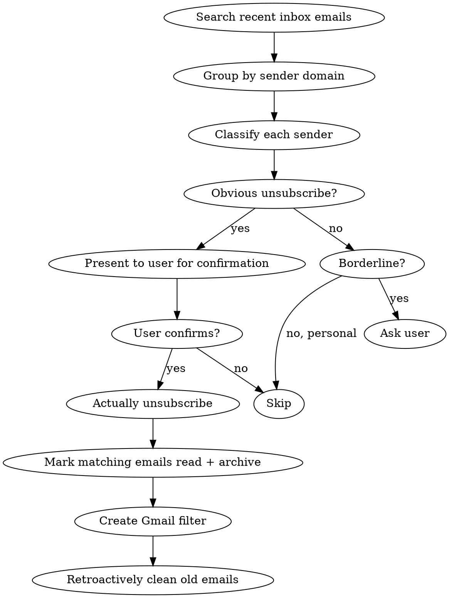

# Email Unsubscribe Check

Scan recent inbox emails to surface promotional, newsletter, and digest senders the user likely wants to unsubscribe from. Actually unsubscribe via browser automation.

## Workflow



## Execution Default

- Start the workflow immediately when this skill is invoked.
- Do not ask a kickoff question like "should I start now?".
- Default scan window is `newer_than:7d` unless the user already specified a different range.
- Only ask a follow-up question before starting if required information is missing and execution would otherwise be blocked.

## How to Scan

1. Search recent emails: `newer_than:7d` (or wider if user requests)
2. Identify senders that look promotional/automated/digest
3. Present findings grouped by confidence:
   - **Clearly unsubscribeable**: marketing, promos, digests user never engages with
   - **Ask user**: newsletters, community content, event platforms (might be wanted)

## Unsubscribe Execution

For each confirmed sender, do ALL of these:

### 1. Actually unsubscribe via browser (most important step)

Two approaches depending on the sender:

**For emails with unsubscribe links:**
- Read the email via Gmail MCP to find the unsubscribe URL (usually at bottom of email body)
- Navigate to the URL with Chrome DevTools MCP
- Take a snapshot, find the confirmation button/checkbox
- Click through to complete the unsubscribe
- Verify the confirmation page

**For services with email settings pages (Nextdoor, LinkedIn, etc.):**
- Navigate to the service's notification/email settings page
- Log in using credentials from `pass` if needed
- Find and disable all email notification toggles
- Check ALL categories (digests, alerts, promotions, etc.)

### 2. Create Gmail filter as backup

Even after unsubscribing, create a filter to catch stragglers:
```
create_filter criteria:{from:"domain.com"} action:{removeLabelIds:["INBOX"]}
```

### 3. Mark old emails as read and archive them (minimum hygiene)

After unsubscribing, clean up existing email from the sender.

- At minimum: mark them as read.
- Preferred/default: also archive them (remove `INBOX` label).

Example:
```
search_emails query:"from:domain.com" maxResults:50
batch_modify_emails messageIds:[...] removeLabelIds:["UNREAD","INBOX"]
```

## Signals That an Email is Unsubscribeable

- "no-reply@" or "newsletter@" sender addresses
- Marketing subject lines: sales, promotions, "don't miss", digests
- Bulk senders: Nextdoor, Yelp, LinkedIn digest, social media notifications
- Community digests the user doesn't engage with
- Financial marketing (not transactional alerts)
- "Your weekly/daily/monthly" summaries

## Signals to NOT Auto-Unsubscribe (Ask First)

- Patreon/creator content
- Event platforms (Luma, Eventbrite, Meetup)
- Professional communities
- Services the user actively uses (even if noisy)
- Transactional emails from wanted services
